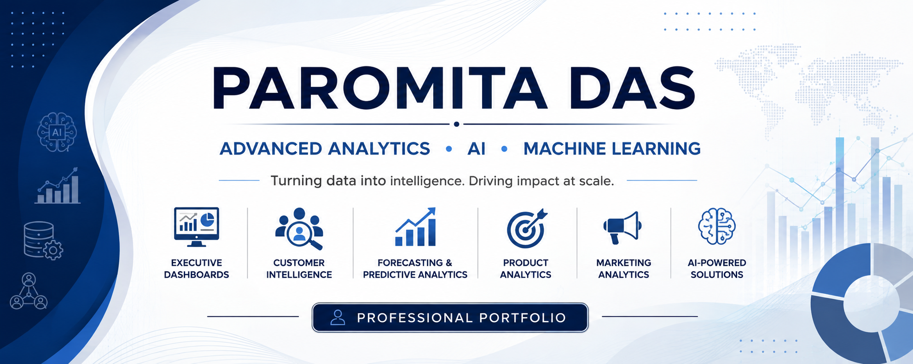

# Paromita Das | Advanced Analytics & AI Portfolio

Professional portfolio showcasing advanced analytics, machine learning, AI, customer intelligence, executive dashboards, and data science projects.

## 🌐 Live Portfolio

https://romy0806.github.io/paromita-portfolio/

---

## About

I'm an Advanced Analytics leader with 14+ years of experience delivering data-driven business solutions across digital media, consumer products, healthcare, and AI-powered decision support.

My work combines:

- Advanced Analytics
- Machine Learning
- Customer Analytics
- Executive Dashboards
- Forecasting
- AI Applications
- Product Analytics
- Marketing Measurement

---

## Featured Projects

### Executive Analytics Intelligence
AI-powered executive dashboard combining Finance, Product, Marketing, Customer, Support, and Social data into a unified executive decision-support platform.

**Technology**

- Python
- Streamlit
- Plotly
- OpenAI
- Executive Analytics

---

### Customer Growth Recommendation Engine

Customer intelligence platform using:

- RFM Segmentation
- Market Basket Analysis
- Product Affinity
- Next-Best Product Recommendations

Business outcome:

- £916K revenue opportunity identified
- £113K cross-sell opportunity

---

### Personalization Engine

Machine learning project predicting customer engagement using:

- K-Means Clustering
- Logistic Regression
- Feature Engineering

Improved AUC by **21%**.

---

### Healthcare Opioid Risk Prediction

Predictive modeling project using healthcare claims data.

Models evaluated:

- Logistic Regression
- Random Forest
- Feature Engineering

---

## Technical Skills

- Python
- SQL
- Streamlit
- Tableau
- Power BI
- Plotly
- Pandas
- Scikit-learn
- Machine Learning
- Predictive Modeling
- Customer Analytics
- Marketing Analytics
- Executive Reporting
- Forecasting

---

## Connect

LinkedIn:
https://www.linkedin.com/in/paromita-das/

GitHub:
https://github.com/romy0806

# 🚀 Portfolio Roadmap

This portfolio is continuously evolving with production-style analytics and AI applications focused on solving real business problems.

## ✅ Completed Projects

- Executive Analytics Intelligence
- Customer Growth Recommendation Engine
- Personalization Engine for Content Optimization
- Healthcare Opioid Risk Prediction

---

## 🔄 Currently Building

### Marketing Analytics Copilot

An AI-powered marketing analytics assistant that combines campaign measurement, customer segmentation, attribution, experimentation, and executive reporting into a conversational decision-support platform.

**Planned Technologies**

- Python
- Streamlit
- OpenAI
- LangChain
- Plotly
- SQL

---

## 🔜 Coming Soon

### Customer Intelligence Agent

AI-powered customer intelligence platform for customer segmentation, churn prediction, lifetime value (LTV), next-best action recommendations, and retention strategy optimization.

---

### Executive Dashboard Chatbot

A conversational AI assistant that enables executives to query Finance, Product, Marketing, Customer, and Operational KPIs using natural language and receive executive-ready insights and recommendations.

---

### Healthcare Demand Forecasting & Scenario Planning

An AI-powered forecasting platform designed for healthcare and life sciences organizations to predict prescription demand, commercial performance, market growth, and revenue scenarios. The platform will combine machine learning, forecasting models, external market signals, and scenario planning to support strategic commercial decision-making.

**Planned Technologies**

- Python
- Prophet
- XGBoost
- Scikit-learn
- Streamlit
- Plotly
- OpenAI

---

More production-ready analytics and AI applications will be added as the portfolio continues to grow.